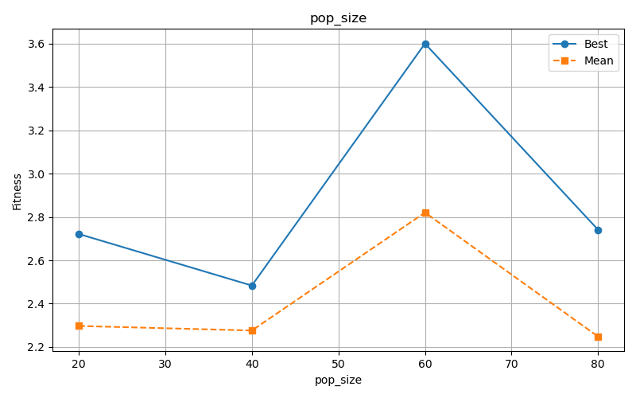
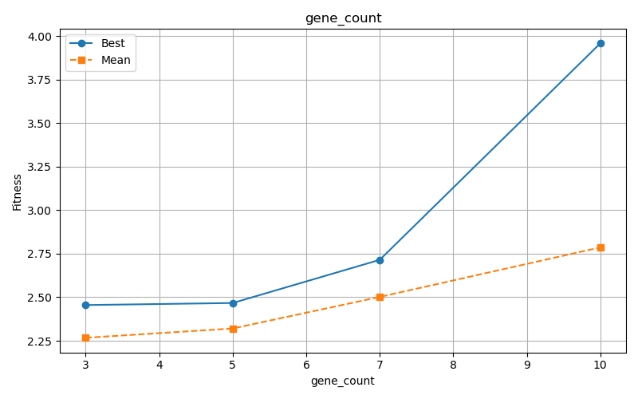
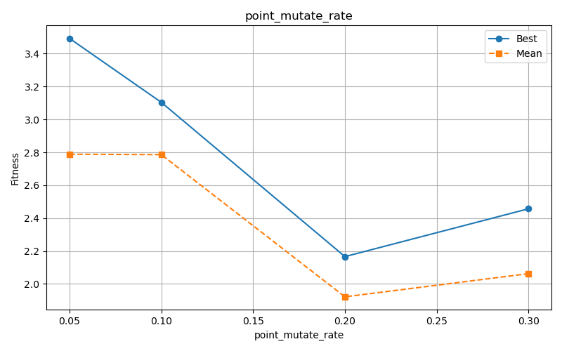
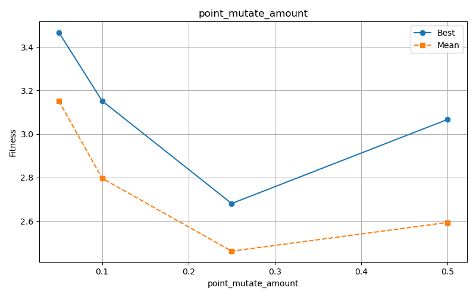
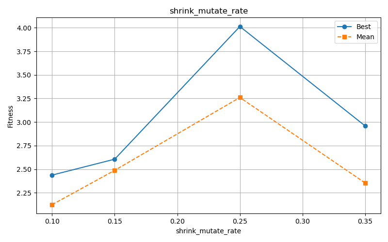
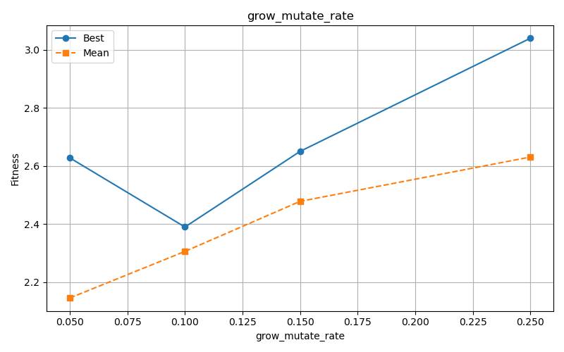
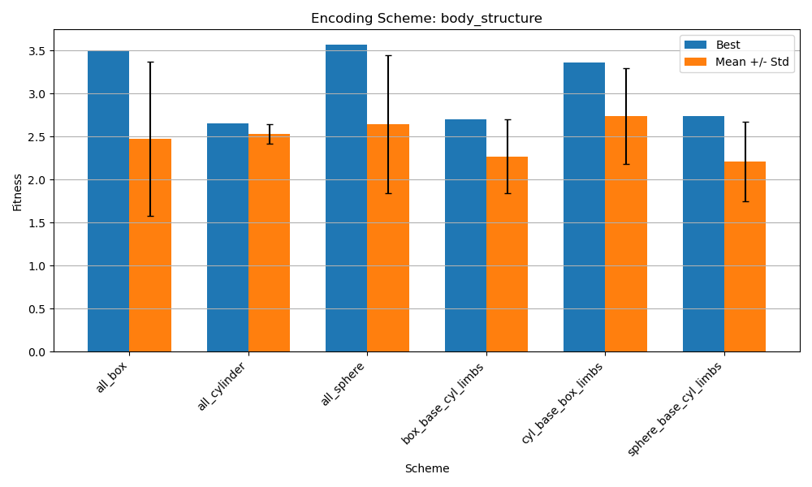
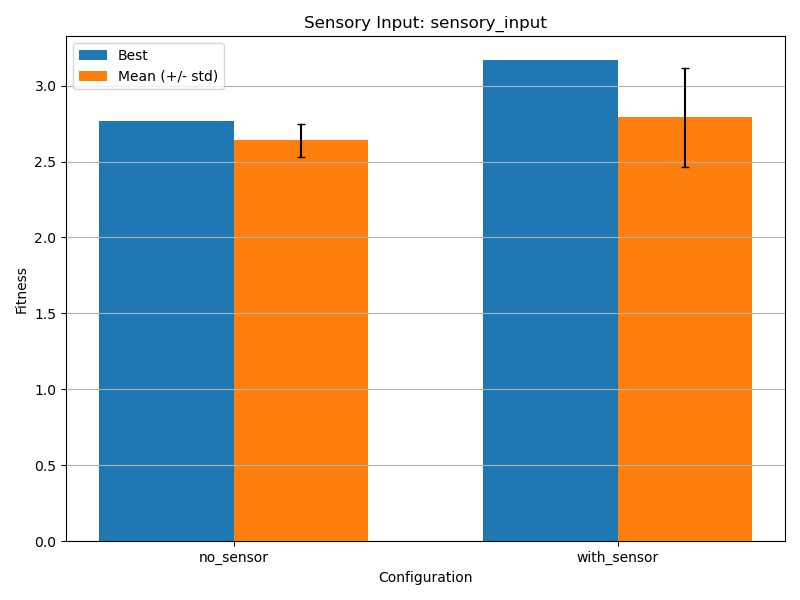

## Set up and testing starting point

I started this project by setting up a stable development environment. Installing pybullet via pip caused repeated issues on my Mac M1, so I switched to a conda-based setup using Python 3.9. Once the environment was created, I verified everything worked by running the default random creature in the mountain environment. On Apple Silicon, I needed to explicitly include a simulation loop using p.stepSimulation() together with a fixed time.sleep(1./240.) delay to ensure the physics engine advanced correctly. After this adjustment, the simulation ran consistently and creatures behaved as expected.

My first objective was not mountain climbing but simple locomotion. Before increasing task difficulty, I wanted to ensure that the genetic algorithm (GA) could reliably evolve walking behavior on flat terrain. Using the provided starter GA, I noticed unstable fitness values across generations (like from ~13 to ~100+). Occasionally, a creature would achieve an extremely high distance in a single generation, which usually corresponded to unrealistic jumping or flying behaviors rather than genuine walking.

To address this I modified the fitness function to penalize unrealistic movement. If a creature’s base rose more than two meters above the ground during evaluation, I treated this as a physics exploit and halved its distance score. This simple heuristic significantly reduced misleading fitness spikes and made evolutionary progress easier to interpret.

```python

    def get_distance_travelled(self):
        if self.start_position is None or self.last_position is None:
            return 0
        p1 = np.asarray(self.start_position)
        p2 = np.asarray(self.last_position)
        dist = np.linalg.norm(p1-p2)

        #penalize jumps/flying behaviors
        if abs(p2[2] - p1[2]) > 2:
            dist = dist * 0.5

        return dist
```

I then introduced two stabilizing changes. First, I implemented a global elitism mechanism that preserves the single best-performing creature across all generations and reinserts it into every new generation. This ensured that progress was never lost due to unlucky mutations. Second, I added persistent logging to CSV files so that best and mean fitness values could be analyzed after each run rather than relying on terminal output.

```python
class TestGA(unittest.TestCase):
    def testBasicGA(self):
        pop = population.Population(pop_size=25,
                                    gene_count=4)
        sim = simulation.Simulation()

        # tracking global best
        best_ever_fitness = 0
        best_ever_dna = None

        for iteration in range(1000):
            for cr in pop.creatures:
                sim.run_creature(cr, 2400)
            fits = [cr.get_distance_travelled()
                    for cr in pop.creatures]
            links = [len(cr.get_expanded_links())
                    for cr in pop.creatures]
            print(iteration, "fittest:", np.round(np.max(fits), 3),
                  "mean:", np.round(np.mean(fits), 3), "mean links", np.round(np.mean(links)), "max links", np.round(np.max(links)))

            # updating   global best if new found
            max_fit = np.max(fits)
            if max_fit > best_ever_fitness:
                best_ever_fitness = max_fit
                for cr in pop.creatures:
                    if cr.get_distance_travelled() == max_fit:
                        best_ever_dna = cr.dna.copy()
                        genome.Genome.to_csv(best_ever_dna, "best_ever.csv")
                        print(f"  NEW BEST: {best_ever_fitness:.3f}")
                        break

            fit_map = population.Population.get_fitness_map(fits)
            new_creatures = []
            for i in range(len(pop.creatures)):
                p1_ind = population.Population.select_parent(fit_map)
                p2_ind = population.Population.select_parent(fit_map)
                p1 = pop.creatures[p1_ind]
                p2 = pop.creatures[p2_ind]
                dna = genome.Genome.crossover(p1.dna, p2.dna)
                dna = genome.Genome.point_mutate(dna, rate=0.1, amount=0.25)
                dna = genome.Genome.shrink_mutate(dna, rate=0.25)
                dna = genome.Genome.grow_mutate(dna, rate=0.1)
                cr = creature.Creature(1)
                cr.update_dna(dna)
                new_creatures.append(cr)

            # for each generation, keep the best ever creature
            if best_ever_dna is not None:
                new_cr = creature.Creature(1)
                new_cr.update_dna(best_ever_dna)
                new_creatures[0] = new_cr

            pop.creatures = new_creatures

        self.assertNotEqual(fits[0], 0)
    unittest.main()

```

```python
if iteration == 0:
    import time
    timestamp = int(time.time())
    fmt_timestamp = time.strftime("%Y-%m-%d_%H-%M-%S")
    with open(f"iteration_logs_{fmt_timestamp}.csv", "w") as f:
        f.write("iteration,fittest,mean_fitness,mean_links,max_links\n")
with open(f"iteration_logs_{fmt_timestamp}.csv", "a") as f:
    f.write(f"{iteration},{np.max(fits)},{np.mean(fits)},{np.mean(links)},{np.max(links)}\n")
```

With these changes in place, I ran baseline walking experiments using a population size of 40, gene count of 5, and 40 generations.

```csv
iteration,fittest,mean_fitness,mean_links,max_links
0,3.8648283324293016,2.108679275898718,14.175,34
1,4.145528164228674,2.1374424819670823,11.85,34
2,4.145528164228674,2.187375028747847,9.175,33
...
991,11.002590238923963,2.742678374540616,2.725,6
992,11.063062588175942,2.6825482384751482,3.05,8 <-- last new best creature found
993,11.063062588175942,2.503953486231804,2
...
```

Then loaded the best creature from the last generation and tested it in the mountain environment:

```python
#set camera position a bit further back to avoid scrolling manually
p.resetDebugVisualizerCamera(cameraDistance=15, cameraYaw=90, cameraPitch=-30, cameraTargetPosition=[0,0,0])

```

```python
p.resetBasePositionAndOrientation(rob1, [7, 0, 1], [0, 0, 0, 1])
start_pos, orn = p.getBasePositionAndOrientation(rob1)

# iterate
elapsed_time = 0
wait_time = 1.0/240 # seconds
total_time = 30 # seconds
step = 0


while True:
    p.stepSimulation()
    step += 1
    if step % 24 == 0:
        motors = cr.get_motors()
        assert len(motors) == p.getNumJoints(rob1), "Something went wrong"
        for jid in range(p.getNumJoints(rob1)):
            mode = p.VELOCITY_CONTROL
            vel = motors[jid].get_output()
            p.setJointMotorControl2(rob1,
                        jid,
                        controlMode=mode,
                        targetVelocity=vel)
        new_pos, orn = p.getBasePositionAndOrientation(rob1)
        #print(new_pos)
        dist_moved = np.linalg.norm(np.asarray(start_pos) - np.asarray(new_pos))
        print(dist_moved)
    time.sleep(wait_time)
    elapsed_time += wait_time
    if elapsed_time > total_time:
        break

print("TOTAL DISTANCE MOVED:", dist_moved)
```

confirming that the evolutionary loop was stable enough to move on to the main challenge: climbing a mountain.

## New fitness function adaptation and high level GA parameters tuning

### fitness function adaptation

The transition from walking to climbing required redefining the fitness function. Instead of rewarding raw distance traveled, the new goal was to maximize progress toward the mountain peak. This raised a design issue: the Creature class computed fitness, while the Simulation class controlled the environment. I wanted to avoid tightly coupling environment logic into the creature representation.

The solution was to let the simulation assign a target_position (the mountain peak) to each creature before evaluation. The creature then computed its fitness as the reduction in Euclidean distance to this target, measured from the start and end of the simulation. The same jump-penalty logic was retained to discourage unrealistic behavior.

```python
class Creature:
    def __init__(self, gene_count):

        self.target_position = None  #new for environment-aware fitness

    def set_target(self, pos):
        self.target_position = pos

    def get_fitness(self):
        if self.start_position is None or self.last_position is None:
            return 0

        # If no target, fall back to distance travelled (for retro compatibility)
        if self.target_position is None:
            return self.get_distance_travelled()

        p1 = np.asarray(self.start_position)
        p2 = np.asarray(self.last_position)
        target = np.asarray(self.target_position)

        initial_dist_to_target = np.linalg.norm(p1 - target)
        final_dist_to_target = np.linalg.norm(p2 - target)

        # Reward -> how much closer the creature got to the target
        progress = initial_dist_to_target - final_dist_to_target

        # penalty for flying/jumping
        if abs(p2[2] - p1[2]) > 2:
            progress = progress * 0.5

        return progress
```

Added SimulationMountain as a specialized subclass that loads the mountain environment and sets the target before running each creature:

```python
class SimulationMountain(Simulation):

    def __init__(self, sim_id=0, peak_position=(0, 0, 5)):
        super().__init__(sim_id)
        self.peak_position = peak_position

    def run_creature(self, cr, iterations=2400):
        # Set target before running
        cr.set_target(self.peak_position)

        pid = self.physicsClientId
        p.resetSimulation(physicsClientId=pid)
        p.setPhysicsEngineParameter(enableFileCaching=0, physicsClientId=pid)

        p.setGravity(0, 0, -10, physicsClientId=pid)
        plane_shape = p.createCollisionShape(p.GEOM_PLANE, physicsClientId=pid)
        p.createMultiBody(plane_shape, plane_shape, physicsClientId=pid)

        # Load mountain
        p.setAdditionalSearchPath('shapes/', physicsClientId=pid)
        mountain_position = (0, 0, -1)
        mountain_orientation = p.getQuaternionFromEuler((0, 0, 0))
        p.loadURDF("gaussian_pyramid.urdf", mountain_position,
                   mountain_orientation, useFixedBase=1, physicsClientId=pid)

        # Create and position creature
        xml_file = 'temp' + str(self.sim_id) + '.urdf'
        xml_str = cr.to_xml()
        with open(xml_file, 'w') as f:
            f.write(xml_str)

        cid = p.loadURDF(xml_file, physicsClientId=pid)
        # Start creature away from mountain base (avoid dropping in steep slope as it  would just bounce off and mess up fitness)
        p.resetBasePositionAndOrientation(cid, [-7, 0, 2.5], [0, 0, 0, 1],
                                         physicsClientId=pid)

        for step in range(iterations):
            p.stepSimulation(physicsClientId=pid)
            if step % 24 == 0:
                self.update_motors(cid=cid, cr=cr)
            pos, orn = p.getBasePositionAndOrientation(cid, physicsClientId=pid)
            cr.update_position(pos)
```

Introducing this new fitness definition exposed an unexpected bug: some creatures produced negative fitness values, which caused failures during parent selection because the selection logic assumed non-negative scores. I fixed this by clamping fitness to zero and adding a small bias proportional to the initial distance from the peak. After this fix, evolution resumed correctly and creatures began to show directional movement toward the mountain.

```python
    def get_fitness(self):
    #...rest of the code
      progress = initial_dist_to_target - final_dist_to_target
        # penaltiy for flying/jumping
        if abs(p2[2] - p1[2]) > 2:
            progress = progress * 0.5
        fitness = max(0, progress + initial_dist_to_target * 0.1)
        return fitness
```

Initial mountain-aware runs produced best fitness values around ~2.2, which, while modest, represented meaningful progress compared to random motion (as expected).

### high level GA parameters tuning

After achieving a stable mountain-aware setup, I focused on systematically improving performance. I selected seven GA parameters for experimentation: population size, gene count, point mutation rate, point mutation amount, shrink mutation rate, grow mutation rate, and elitism count. For each parameter, I defined four candidate values and ran three trials per value to partially account for stochastic variation.

Before running the experiments, I noticed that point_mutate() function ignored the mutation amount parameter entirely. Once corrected, mutation magnitude began influencing results as expected.

For the folder structure, I organized results like this (and it will be the recurring framework that I will use for future experiments -> experimet type results folder and corresponding plots folder):

```
results/
├── pop_size/
│   ├── pop_size_20_trial_0/
│   │   ├── iteration_logs_2025-12-30_20-41-33.csv
│   │   └── best_ever.csv
│   ├── pop_size_20_trial_1/
│   └── ...
├── gene_count/
│   └── ...
└── summary_results.csv
```

This way each experiment has its own folder with logs, and if the script crashes I can resume without losing everything - the `save_to_csv()` function saves after each parameter is done testing.

I also added an early-stopping mechanism that terminated runs after a fixed number of generations without improvement. Initially, this threshold was set to 75 generations, based on manual observations that improvements sometimes occurred after long plateaus.

Running the full sweep (with 3 trials per parameter value) exposed several practical issues. High gene counts sometimes produced URDFs too complex for PyBullet, causing simulation crashes. To prevent entire runs from failing, I wrapped simulation calls in try/except blocks and assigned zero fitness to creatures that could not be simulated. This implicitly penalized overly complex morphologies.

Runtime quickly became a bottleneck. Larger populations and complex creatures significantly increased simulation time, and tiny noisy improvements often reset the stagnation counter. A lesson learned was the early stopping mechanism could be improved. Currently, any improvement, no matter how small, resets the stagnant generation counter. Going back, it would have been better to only reset it for meaningful improvements. e.g. condition for reset -> max_fit > best_fitness + min improvement treshold.

```python
try:
    cid = p.loadURDF(xml_file, physicsClientId=pid)
    if cid < 0:
        cr.update_position([-7, 0, 2.5])  # zero fitness
        return
    # ... simulation loop ...
except Exception as e:
    print(f"  [Warning] Creature failed to simulate: {e}")
    cr.update_position([-7, 0, 2.5])  # give it zero fitness

```

Despite these challenges, several trends emerged that were consistent across multiple runs. Larger populations and higher gene counts often achieved better peak fitness because they increased diversity and allowed more complex morphologies to be explored. However, this came at a high computational cost and sometimes resulted in diminishing returns, where additional complexity did not translate into better climbing behavior. Lower mutation rates and smaller mutation amounts consistently performed better, suggesting that once a reasonable morphology was discovered, fine-grained local search was more effective than aggressive exploration. Increased elitism also helped, especially for this difficult task, because good partial solutions were preserved long enough to be refined rather than destroyed by mutation.

An interesting observation worth mentioning is that some creature seemed to exploit the arena edges to orientate themselfs by slightly bumping against it until they found a better orientation that would grant higher score (this observation will be the base upon which I chose my extension)

After all 84 runs completed, I used `plot_results.py` to generate visualizations. Here's the summary of best parameter values found:

| Parameter           | Best Value | Best Fitness | Mean Fitness |
| ------------------- | ---------- | ------------ | ------------ |
| pop_size            | 60         | 3.60         | 2.82         |
| gene_count          | 10         | 3.96         | 2.79         |
| point_mutate_rate   | 0.05       | 3.49         | 2.79         |
| point_mutate_amount | 0.05       | 3.47         | 3.15         |
| shrink_mutate_rate  | 0.25       | 4.01         | 3.26         |
| grow_mutate_rate    | 0.25       | 3.04         | 2.63         |
| elitism_count       | 5          | 4.13         | 3.22         |


Here are all different chart results from the plots folder:









At the same time, these experiments highlighted an important limitation of isolated parameter tuning. When I combined the individually best-performing values for what I was expecting to be the "final" run with all optimal settings
the resulting runs did not outperform the strongest individual experiments , for example iteration 2 with elitsm count of 5 (4.127 fitness) or iteration 1 with point_mutate with value 0.25 (4.01) beat all 3 best fitness scores with the final configuration which didn't pass 3.36. This made me reflect on strong interactions between parameters: for example, higher elitism works well with lower mutation rates but can be harmful when combined with high mutation, and larger populations amplify the cost of high gene counts. This reinforced the idea that evolutionary systems must be tuned holistically rather than one parameter at a time, and that empirical testing is essential.

## Genetic Decoding Scheme Experiments - Body Structure (Advanced coursework topics)

To explore morphology effects, I modified the URDF generation process to support different geometric shapes, including cylinders, boxes, spheres, and mixed configurations. I introduced an is_root flag to differentiate the base link from limbs and ran controlled experiments for each shape scheme.

```python
ENCODING_CONFIG = {
    'base_shape': 'cylinder',
    'limb_shape': 'cylinder',
}

def set_encoding_config(config):
    global ENCODING_CONFIG
    ENCODING_CONFIG.update(config)

def get_encoding_config():
    return ENCODING_CONFIG.copy()

def reset_encoding_config():
    global ENCODING_CONFIG
    ENCODING_CONFIG = {
        'base_shape': 'cylinder',
        'limb_shape': 'cylinder',
    }
```

```python
link = URDFLink(name=link_name,
                # ... other params ...
                is_root=(link_ind == 0))
```

Across six shape schemes and three trials each:

### Results

| Scheme                | Best Fitness | Mean Fitness | Std Dev |
| --------------------- | ------------ | ------------ | ------- |
| all_cylinder          | 2.657        | 2.529        | 0.115   |
| all_box               | 3.503        | 2.472        | 0.896   |
| all_sphere            | 3.566        | 2.644        | 0.804   |
| box_base_cyl_limbs    | 2.704        | 2.271        | 0.429   |
| sphere_base_cyl_limbs | 2.738        | 2.211        | 0.460   |
| cyl_base_box_limbs    | 3.363        | 2.739        | 0.555   |



### Analysis and observations

Some interesting patterns emerged from these experiments:

1. **Spheres performed best on average** - Likely due to rolling behavior on slopes
2. **Cylinders were most consistent** - Lowest variance across trials
3. **Mixed shapes underperformed** - Inconsistent physics may be harder to optimize
4. **High variance in some schemes** - More trials needed for reliable conclusions

Differences were noticeable but smaller than those produced by GA parameter tuning. One challenge during these experiments was the relatively high variance between trials, especially for sphere-based morphologies. In some runs, creatures learned to exploit rolling behavior effectively, while in others they failed to stabilize and achieved mediocre fitness. This made it difficult to draw strong conclusions from a small number of trials and highlighted the need for more repetitions when evaluating morphology-related changes.

After running the experiments, I tried to view the best creature from the "all_box" experiment using `cw_envt_copy.py`. But it still showed up as cylinders! I was confused for a bit until I realized the issue.The shape information was not encoded in DNA but applied globally during URDF generation. This meant that saved genomes could be rendered incorrectly when reloaded. To mitigate this, I modified the visualization script to apply the correct shape configuration when displaying saved creatures.

```python
# shape configs for viewing creatures from the experiments
# NOTE: the shape isnt stored in the DNA, its determined when generating the URDF
# I realized I need to set this before loading a creature or it will just show cylinders
SHAPE_CONFIGS = {
    'all_cylinder': {'base_shape': 'cylinder', 'limb_shape': 'cylinder'},
    'all_box': {'base_shape': 'box', 'limb_shape': 'box'},
    'all_sphere': {'base_shape': 'sphere', 'limb_shape': 'sphere'},
    'box_base_cyl_limbs': {'base_shape': 'box', 'limb_shape': 'cylinder'},
    'sphere_base_cyl_limbs': {'base_shape': 'sphere', 'limb_shape': 'cylinder'},
    'cyl_base_box_limbs': {'base_shape': 'cylinder', 'limb_shape': 'box'},
}
```

Now it was possible to specify which shape config to use: `python cw_envt_copy.py best_ever.csv all_box`

Another insight was that morphology alone rarely solved the climbing problem. Even the best-performing shapes still required suitable GA parameters and sufficient evolutionary time to produce meaningful improvement. This suggests that morphology acts more as an enabler or constraint on learning rather than a direct driver of performance.

## Exceptional Grade Extension: Sensory Input

For the exceptional grade criteria, I implemented a sensory input extension. Currently, motors oscillate blindly without environmental awareness. My extension adds a **direction sensor** that tells each motor which way the peak is. The idea came after the observation that some creatures exploited arena edges to orient themselves. I wanted to build up on what seemed a interesting natural emergent and give more structure to this.

### The concept

Each motor gets a new evolvable gene: `sensor_weight` (0 to 1). During simulation, a `direction_signal` based on peak position (-1 to +1) modulates motor output: `base_output * (1 + sensor_weight * direction_signal)`.

Crucially, `sensor_weight` is evolvable—if sensors don't help, evolution can set it to 0 and behavior remains unchanged.

### Code changes

**1. New sensor-weight gene in genome.py:**

```python
"sensor-weight": {"scale": 1}  # how much motor responds to direction sensor
```

And added a `use_sensors` flag to the encoding config so I can enable/disable sensors globally for experiments:

```python
ENCODING_CONFIG = {
    'base_shape': 'cylinder',
    'limb_shape': 'cylinder',
    'use_sensors': True,  # if False, sensors are disabled even if sensor_weight > 0
}
```

**2. Motor class enhancement in creature.py:**

```python
class Motor:
    def __init__(self, control_waveform, control_amp, control_freq, sensor_weight=0):
        # ... existing code ...
        self.sensor_weight = sensor_weight  # how much this motor responds to direction sensor

    def get_output(self, sensor_signal=0):
        # ... generates base output (PULSE or SINE) ...

        # modulate output based on sensor input (if we have any)
        # sensor_signal is like -1 to 1 (direction to peak)
        # sensor_weight controls how much the motor cares about it
        if self.sensor_weight > 0 and sensor_signal != 0:
            output = output * (1 + self.sensor_weight * sensor_signal)

        return output
```

The modulation is multiplicative -> if the creature is facing toward the peak (positive signal), motors with high sensor_weight will move faster. If facing away (negative signal), they'll move slower. This should create a bias toward the peak direction.

**3. Direction calculation in simulation.py:**

```python
def _calc_direction_signal(self, pos):
    """
    figure out how much the creature is facing the peak
    returns -1 (facing away) to +1 (facing toward)
    pretty simple -> just looks at x direction toward peak
    """
    if self.peak_position is None:
        return 0
    dx = self.peak_position[0] - pos[0]
    dy = self.peak_position[1] - pos[1]
    dist = np.sqrt(dx*dx + dy*dy)
    if dist < 0.1:
        return 0  # close enough, no signal needed
    # normalize x component to -1 to 1
    return np.clip(dx / dist, -1, 1)
```

### Results

| Configuration | Best Fitness | Mean Fitness | Std Dev |
| ------------- | ------------ | ------------ | ------- |
| no_sensor     | 2.765        | 2.641        | 0.109   |
| with_sensor   | 3.166        | 2.791        | 0.325   |



### Analysis

Sensors improved best fitness by **14.5%** and mean fitness by **5.7%**. The increased standard deviation with sensors suggests a more complex search space—when evolution discovers effective sensor usage, results improve substantially, but not all trials achieve this.

Motors can bias movement toward the peak, and even small directional biases compound over many cycles. The multiplicative modulation preserves rhythmic patterns while adding directional preference.

### Why this qualifies as exceptional work

This extension addresses suggested exceptional criteria by extending genetic encoding with a new evolvable gene, implementing environmental sensing that evolution can exploit, and following the structured experiment design established throughout this project.
