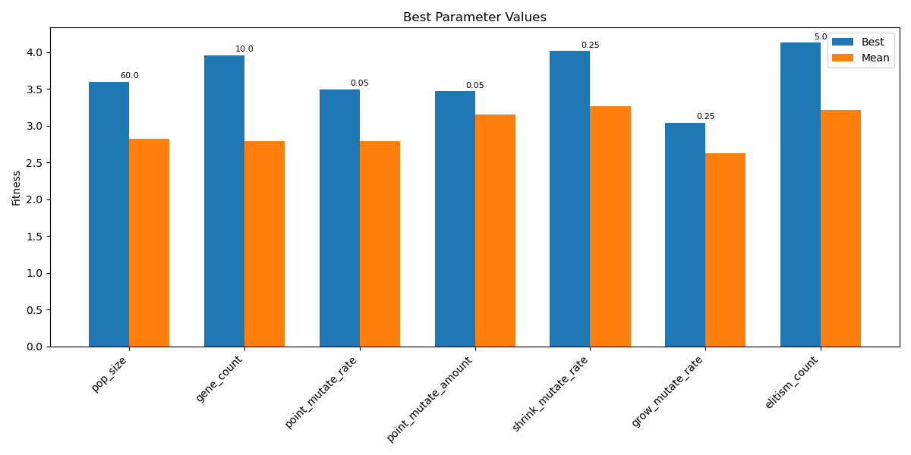

## Set up and testing starting point

1. I created a virtual environment using anaconda (I was habving troubles installing pybullet with pip as it was failing to build the wheel).
   The environment used python 3.9 (well known for good stability and compatibility), pybullet 3.25, and matplot lib 3.9.2.

2. I tested that everithing works by loading the new mountain env and testing it with the default random creature. I was able to see what expected, I just had to add the usual block:

```code
while True:
    p.stepSimulation()
    time.sleep(1./240.)
```

to make it work on my mac m1.

3. Before now before loading any creature in the new sandbox I wanted to make sure that before climbing the creature could at least walk and try that as baseline, so I just ran the test_ga_no_threads script and see which creature I could get.

The starting script as it was from the starter code was saving a new creature for each iteration, and also the creatures fitness were regressing too much, so the first thing I changed was saving the best creature overall and implement elitism in a way that the best overall was added to each new generation:

```python
class TestGA(unittest.TestCase):
    def testBasicGA(self):
        pop = population.Population(pop_size=25,
                                    gene_count=4)
        sim = simulation.Simulation()

        # tracking global best
        best_ever_fitness = 0
        best_ever_dna = None

        for iteration in range(1000):
            for cr in pop.creatures:
                sim.run_creature(cr, 2400)
            fits = [cr.get_distance_travelled()
                    for cr in pop.creatures]
            links = [len(cr.get_expanded_links())
                    for cr in pop.creatures]
            print(iteration, "fittest:", np.round(np.max(fits), 3),
                  "mean:", np.round(np.mean(fits), 3), "mean links", np.round(np.mean(links)), "max links", np.round(np.max(links)))

            # updating   global best if new found
            max_fit = np.max(fits)
            if max_fit > best_ever_fitness:
                best_ever_fitness = max_fit
                for cr in pop.creatures:
                    if cr.get_distance_travelled() == max_fit:
                        best_ever_dna = cr.dna.copy()
                        genome.Genome.to_csv(best_ever_dna, "best_ever.csv")
                        print(f"  NEW BEST: {best_ever_fitness:.3f}")
                        break

            fit_map = population.Population.get_fitness_map(fits)
            new_creatures = []
            for i in range(len(pop.creatures)):
                p1_ind = population.Population.select_parent(fit_map)
                p2_ind = population.Population.select_parent(fit_map)
                p1 = pop.creatures[p1_ind]
                p2 = pop.creatures[p2_ind]
                dna = genome.Genome.crossover(p1.dna, p2.dna)
                dna = genome.Genome.point_mutate(dna, rate=0.1, amount=0.25)
                dna = genome.Genome.shrink_mutate(dna, rate=0.25)
                dna = genome.Genome.grow_mutate(dna, rate=0.1)
                cr = creature.Creature(1)
                cr.update_dna(dna)
                new_creatures.append(cr)

            # for each generation, keep the best ever creature
            if best_ever_dna is not None:
                new_cr = creature.Creature(1)
                new_cr.update_dna(best_ever_dna)
                new_creatures[0] = new_cr

            pop.creatures = new_creatures

        self.assertNotEqual(fits[0], 0)
    unittest.main()

```

and then added a log file to track the progress of the evolution:

```python
if iteration == 0:
    import time
    timestamp = int(time.time())
    fmt_timestamp = time.strftime("%Y-%m-%d_%H-%M-%S")
    with open(f"iteration_logs_{fmt_timestamp}.csv", "w") as f:
        f.write("iteration,fittest,mean_fitness,mean_links,max_links\n")
with open(f"iteration_logs_{fmt_timestamp}.csv", "a") as f:
    f.write(f"{iteration},{np.max(fits)},{np.mean(fits)},{np.mean(links)},{np.max(links)}\n")
```

and implemnted a penalty for huge jumps in the get_distance_travelled method of creature.py, given that in certain runs the creatures were suspiciouly going from a fitnes of ~10/11 to a fitness of ~130 in one generation and then when loading the creature in the env they were just jumping forward, probably due to some weird combination of link lengths and joint angles/amplitudes/frequencies.:

```python

    def get_distance_travelled(self):
        if self.start_position is None or self.last_position is None:
            return 0
        p1 = np.asarray(self.start_position)
        p2 = np.asarray(self.last_position)
        dist = np.linalg.norm(p1-p2)

        #penalize jumps/flying behaviors
        if abs(p2[2] - p1[2]) > 2:
            dist = dist * 0.5

        return dist
```

I tried a full run of 40 generations with population 40 and gene count 5, which
seemed to produce acceptable results (quick baseline with default parameters), with a baseline creature that was least able to walk.

```csv
iteration,fittest,mean_fitness,mean_links,max_links
0,3.8648283324293016,2.108679275898718,14.175,34
1,4.145528164228674,2.1374424819670823,11.85,34
2,4.145528164228674,2.187375028747847,9.175,33
...
991,11.002590238923963,2.742678374540616,2.725,6
992,11.063062588175942,2.6825482384751482,3.05,8 <-- last new best creature found
993,11.063062588175942,2.503953486231804,2
...
```

4. Next up I will try to load this baseline creature in the new mountain env and see how it performs there.

I transferred the code from realtime_from_csv.py to cw-envt_copy.py to have a starting point for testing the best creature in the new env. I just adapted the spawn point of the creature so that it starts a bit further back from the mountain base, and set the camera a bit further back so that I can see the creature approaching the mountain without having to scroll manually.

```python
#set camera position a bit further back to avoid scrolling manually
p.resetDebugVisualizerCamera(cameraDistance=15, cameraYaw=90, cameraPitch=-30, cameraTargetPosition=[0,0,0])

```

```python
p.resetBasePositionAndOrientation(rob1, [7, 0, 1], [0, 0, 0, 1])
start_pos, orn = p.getBasePositionAndOrientation(rob1)

# iterate
elapsed_time = 0
wait_time = 1.0/240 # seconds
total_time = 30 # seconds
step = 0


while True:
    p.stepSimulation()
    step += 1
    if step % 24 == 0:
        motors = cr.get_motors()
        assert len(motors) == p.getNumJoints(rob1), "Something went wrong"
        for jid in range(p.getNumJoints(rob1)):
            mode = p.VELOCITY_CONTROL
            vel = motors[jid].get_output()
            p.setJointMotorControl2(rob1,
                        jid,
                        controlMode=mode,
                        targetVelocity=vel)
        new_pos, orn = p.getBasePositionAndOrientation(rob1)
        #print(new_pos)
        dist_moved = np.linalg.norm(np.asarray(start_pos) - np.asarray(new_pos))
        print(dist_moved)
    time.sleep(wait_time)
    elapsed_time += wait_time
    if elapsed_time > total_time:
        break

print("TOTAL DISTANCE MOVED:", dist_moved)
```

I see the creature is loaded correctly and it is able to walk in the new env, but it is not climbing yet, I will try to experiment now with the fitness function and the GA parameters to see if I can get it to climb the mountain.

## New fitness function adaptation and high level GA parameters tuning

### fitness function adaptation

After establishing a baseline walking creature (fitness ~11) on a flat plane, the next challenge was implementing an environment-aware fitness function to reward creatures for climbing toward the mountain peak. This required solving an architectural problem: how to pass environmental information (specifically, the peak location) to the creature's fitness calculation.

The initial difficulty was determining where to store and access the mountain peak coordinates. Simulation class runs the creature, but the fitness is calculated within the Creature class. This separation of concerns created a coupling problem - the creature needed to know about the environment without the simulation class becoming overly complex.

Initial Implementation Approach
The solution involved a three-part architectural change.

Adding Target Awareness to Creature

Modified Creature to store a target position and calculate fitness based on progress towards that target,

```python
class Creature:
    def __init__(self, gene_count):

        self.target_position = None  # NEW: for environment-aware fitness

    def set_target(self, pos):
        self.target_position = pos

    def get_fitness(self):
        if self.start_position is None or self.last_position is None:
            return 0

        # If no target, fall back to distance travelled (for retro compatibility)
        if self.target_position is None:
            return self.get_distance_travelled()

        p1 = np.asarray(self.start_position)
        p2 = np.asarray(self.last_position)
        target = np.asarray(self.target_position)

        initial_dist_to_target = np.linalg.norm(p1 - target)
        final_dist_to_target = np.linalg.norm(p2 - target)

        # Reward -> how much closer the creature got to the target
        progress = initial_dist_to_target - final_dist_to_target

        # penalty for flying/jumping
        if abs(p2[2] - p1[2]) > 2:
            progress = progress * 0.5

        return progress
```

2. Creating Mountain Simulation Class

Added SimulationMountain as a specialized subclass that loads the mountain environment and sets the target before running each creature:

```python
class SimulationMountain(Simulation):

    def __init__(self, sim_id=0, peak_position=(0, 0, 5)):
        super().__init__(sim_id)
        self.peak_position = peak_position

    def run_creature(self, cr, iterations=2400):
        # Set target before running
        cr.set_target(self.peak_position)

        pid = self.physicsClientId
        p.resetSimulation(physicsClientId=pid)
        p.setPhysicsEngineParameter(enableFileCaching=0, physicsClientId=pid)

        p.setGravity(0, 0, -10, physicsClientId=pid)
        plane_shape = p.createCollisionShape(p.GEOM_PLANE, physicsClientId=pid)
        p.createMultiBody(plane_shape, plane_shape, physicsClientId=pid)

        # Load mountain
        p.setAdditionalSearchPath('shapes/', physicsClientId=pid)
        mountain_position = (0, 0, -1)
        mountain_orientation = p.getQuaternionFromEuler((0, 0, 0))
        p.loadURDF("gaussian_pyramid.urdf", mountain_position,
                   mountain_orientation, useFixedBase=1, physicsClientId=pid)

        # Create and position creature
        xml_file = 'temp' + str(self.sim_id) + '.urdf'
        xml_str = cr.to_xml()
        with open(xml_file, 'w') as f:
            f.write(xml_str)

        cid = p.loadURDF(xml_file, physicsClientId=pid)
        # Start creature away from mountain base (avoid dropping in steep slope as it  would just bounce off and mess up fitness)
        p.resetBasePositionAndOrientation(cid, [-7, 0, 2.5], [0, 0, 0, 1],
                                         physicsClientId=pid)

        for step in range(iterations):
            p.stepSimulation(physicsClientId=pid)
            if step % 24 == 0:
                self.update_motors(cid=cid, cr=cr)
            pos, orn = p.getBasePositionAndOrientation(cid, physicsClientId=pid)
            cr.update_position(pos)
```

3. Updating GA Script

Modified test_ga_no_threads.py to use the new simulation:

```python
sim = simulation.SimulationMountain(peak_position=(0, 0, 5))

for iteration in range(1000):
    for cr in pop.creatures:
        sim.run_creature(cr, 2400)
    fits = [cr.get_fitness() for cr in pop.creatures]
```

Critical Bug: Negative Fitness Values Breaking Parent Selection
After implementing these changes, the GA script failed with an error during parent selection:

0 fittest: 0.597 mean: -1.009 mean links 14.0 max links 58
p1_ind: 0, p2_ind: 0
...
p1_ind: 0, p2_ind: None
ERROR: testBasicGA (**main**.TestGA)
Traceback (most recent call last):
File "/Users/edoardo/AI-Midterm/src/test_ga_no_threads.py", line 70, in testBasicGA
p2 = pop.creatures[p2_ind]
TypeError: list indices must be integers or slices, not NoneType

the way I fixed it was to ensure that the fitness function never returned negative values by clamping progress to a minimum of zero:

```python
    def get_fitness(self):
    #...rest of the code
      progress = initial_dist_to_target - final_dist_to_target
        # penaltiy for flying/jumping
        if abs(p2[2] - p1[2]) > 2:
            progress = progress * 0.5
        fitness = max(0, progress + initial_dist_to_target * 0.1)
        return fitness
```

After these changes, the GA ran successfully, evolving creatures that, even though did not climb perfectly, there were clearly aiming towards the mountain peak. After the adjustments and initial training paramenters of:
pop_size=40, gene_count=5, 40 generations and all the rest as default.

I have obtained a best creature with a new best fitness of 2.686.

As a sidenote I am considering implementing a counter of how many generations go without improvment and considering breaking it early if exceeded a certain threshold, to save computation time, as I am forced to train in a single thread on my mac due to pybullet m1 issues with multithreading and training seems to take very long.

### high level GA parameters tuning

Before diving into experiments, I spent some time researching which parameters would have the most impact on the GA performance. Based on the course materials and some reading online, I identified 7 key parameters to tune:

1. **pop_size** - population size, affects exploration vs exploitation balance
2. **gene_count** - number of genes, directly controls creature complexity
3. **point_mutate_rate** - how often individual gene values mutate
4. **point_mutate_amount** - how much values change when mutated
5. **shrink_mutate_rate** - probability of removing a gene
6. **grow_mutate_rate** - probability of adding a new gene
7. **elitism_count** - how many top creatures survive unchanged

I started by setting up a baseline configuration based on what seemed reasonable from my initial tests:

```python
DEFAULT_CONFIG = {
    'pop_size': 40,
    'gene_count': 5,
    'point_mutate_rate': 0.1,
    'point_mutate_amount': 0.25,
    'shrink_mutate_rate': 0.25,
    'grow_mutate_rate': 0.1,
    'elitism_count': 1,
    'max_stagnant_generations': 75,
    'simulation_iterations': 2400,
    'peak_position': (0, 0, 5),
}
```

#### Bug fix: point_mutate wasn't using the amount parameter

While reviewing the code before running experiments, I noticed that in genome.py, `point_mutate` function wasn't actually using the `amount` parameter so I adapted it:

```python
# after (fixed):
gene[i] += random.uniform(-amount, amount)
```

This was a pretty important because it meant my mutation amount experiments would have been useless otherwise. I opted for bidirectional mutation also as it makes more biological sense - values can increase or decrease.

#### Setting up the experiment infrastructure

I wanted to test each parameter systematically, so I created a separate script `ga_param_tests.py` that would run through all the combinations. The idea was to have a config file that made it easy to define what to test:

```python
EXPERIMENTS = {
    'pop_size': [20, 40, 60, 80],
    'gene_count': [3, 5, 7, 10],
    'point_mutate_rate': [0.05, 0.1, 0.2, 0.3],
    'point_mutate_amount': [0.05, 0.1, 0.25, 0.5],
    'shrink_mutate_rate': [0.1, 0.15, 0.25, 0.35],
    'grow_mutate_rate': [0.05, 0.1, 0.15, 0.25],
    'elitism_count': [1, 2, 3, 5],
}
```

For the folder structure, I organized results like this:

```
results/
├── pop_size/
│   ├── pop_size_20_trial_0/
│   │   ├── iteration_logs_2025-12-30_20-41-33.csv
│   │   └── best_ever.csv
│   ├── pop_size_20_trial_1/
│   └── ...
├── gene_count/
│   └── ...
└── summary_results.csv
```

This way each experiment has its own folder with logs, and if the script crashes I can resume without losing everything - the `save_to_csv()` function saves after each parameter is done testing.

#### Early stopping mechanism

I implemented early stopping to avoid wasting time on runs that have stagnated. The logic is simple: track how many generations go by without improvement, and stop if it exceeds a threshold:

```python
if stagnant >= cfg['max_stagnant_generations']:
    print(f"Early stopping at gen {gen}")
    break

# later in the loop:
if max_fit > best_fitness:
    stagnant = 0  # reset counter
    best_fitness = max_fit
else:
    stagnant += 1
```

I set `max_stagnant_generations = 75` initially because in some of my earlier manual runs I noticed improvements happening even after 50+ generations of no change. In hindsight, 75 was probably too high,but more on that later.

#### Running 3 trials per configuration

Since GAs are stochastic (random initial population, random mutations, etc.), running each configuration only once wouldn't be reliable. I decided on 3 trials per configuration:

```python
NUM_TRIALS = 3

for val in values:
    for t in range(NUM_TRIALS):
        res = run_ga(config=cfg, save_dir=str(save_dir))
```

This gives me both a "best" result (the best across all 3 trials) and a "mean" result (average performance), which helps distinguish lucky runs from genuinely good parameter values. Total experiments: 7 parameters × 4 values × 3 trials = 84 runs.

#### Bug encountered: PyBullet crashing with complex creatures

When the experiments got to testing `gene_count=7` and `gene_count=10`, I started seeing crashes:

```
pybullet.error: GetBasePositionAndOrientation failed.
```

After some investigation, I realized the problem: creatures with high gene counts were generating very complex URDF files (90+ links!) that PyBullet couldn't handle properly. The crash would happen during simulation, not during URDF loading.

I fixed this by wrapping the simulation in a try/except block in `simulation.py`:

```python
try:
    cid = p.loadURDF(xml_file, physicsClientId=pid)
    if cid < 0:
        cr.update_position([-7, 0, 2.5])  # zero fitness
        return
    # ... simulation loop ...
except Exception as e:
    print(f"  [Warning] Creature failed to simulate: {e}")
    cr.update_position([-7, 0, 2.5])  # give it zero fitness
```

This way, invalid creatures just get zero fitness and the evolution can continue. Interestingly, this acted as a natural selection pressure against overly complex creatures that couldn't even be simulated!

#### Running the full experiment

I left the full parameter test running overnight on my Mac M1 (8GB RAM). It took way longer than expected - over 12 hours and it still wasn't done when I checked in the morning. The problem was that some configurations (especially high pop_size combined with the early stopping threshold of 75) were taking hundreds of generations before stopping.

Looking at the logs, I noticed something: sometimes there would be tiny improvements like 0.001 in fitness that would reset the stagnation counter. Technically that's an "improvement" but it's basically noise. In future runs I would add a minimum improvement threshold, something like:

```python
if max_fit > best_fitness + 0.01:  # require meaningful improvement
    stagnant = 0
```

#### Results and analysis

After all 84 runs completed, I used `plot_results.py` to generate visualizations. Here's the summary of best parameter values found:

| Parameter           | Best Value | Best Fitness | Mean Fitness |
| ------------------- | ---------- | ------------ | ------------ |
| pop_size            | 60         | 3.60         | 2.82         |
| gene_count          | 10         | 3.96         | 2.79         |
| point_mutate_rate   | 0.05       | 3.49         | 2.79         |
| point_mutate_amount | 0.05       | 3.47         | 3.15         |
| shrink_mutate_rate  | 0.25       | 4.01         | 3.26         |
| grow_mutate_rate    | 0.25       | 3.04         | 2.63         |
| elitism_count       | 5          | 4.13         | 3.22         |



Some interesting observations from the results:

**Gene count and pop_size had the biggest impact on computation time.** Higher values mean more creatures to simulate, and more complex creatures take longer to evaluate. A run with pop_size=80 and gene_count=10 could take significantly longer than the baseline.

**Lower mutation rates performed better.** Both `point_mutate_rate=0.05` and `point_mutate_amount=0.05` came out on top. This suggests that for this problem, fine-grained exploration works better than large random jumps.

**Higher elitism helped.** Having `elitism_count=5` (preserving the top 5 creatures each generation) gave better results than just keeping 1. This makes sense for a difficult optimization problem - you don't want to lose good solutions by accident.

**The shrink/grow balance matters.** Both settled at 0.25, meaning equal rates for adding and removing genes. The default had shrink at 0.25 and grow at 0.1, which was biased toward simpler creatures.

#### The unexpected result: combining "best" parameters

Here's where things got interesting. I expected that combining all the best parameter values would give me the best possible creature. So I ran 3 trials with the "optimal" config:

```python
{
    'pop_size': 60,
    'gene_count': 10,
    'point_mutate_rate': 0.05,
    'point_mutate_amount': 0.05,
    'shrink_mutate_rate': 0.25,
    'grow_mutate_rate': 0.25,
    'elitism_count': 5,
}
```

But surprisingly, none of these runs beat the best individual runs from the parameter tests! Looking at `summary_results.csv`, the actual best fitness achieved was **4.736** from a run with `elitism_count=1` that went for 1378 generations. The second best was **4.127** with `elitism_count=5`.

This taught me something important: parameters interact with each other in complex ways. The "best" value for one parameter might depend on the values of other parameters. Optimizing each in isolation and then combining them doesn't guarantee the global optimum.

Some specific values from the summary results:

```csv
elitism_count,1,2,4.736213826117916,1378,1302  # the best!
shrink_mutate_rate,0.25,0,4.013543435273533,407,331
elitism_count,5,1,4.127195497005609,524,448
gene_count,10,0,3.958499381825633,425,349
```

#### Observations from watching the evolved creature

After loading the best creature in `cw_envt_copy.py`, I could clearly see it was targeting the mountain peak. Some interesting behaviors I noticed:

1. **The creature was definitely aiming toward the peak** - not just randomly moving. The fitness function adaptation was working.

2. **It seemed to use the arena edges to reorient itself** when it slipped or tipped over. Whether this was evolved or accidental is hard to say, but it was clever behavior.

3. **The main issue was grip/traction.** The creature would approach the mountain but couldn't climb effectively. It would slip back down on the slopes. I suspect this is partly due to the cylindrical link shapes that are generated - maybe different shapes would give better grip. This is something to explore in the genome tuning phase.

4. **Complex creatures (high gene count) took longer to evolve but showed more interesting behaviors.** They had more "body parts" to work with and could potentially develop more sophisticated climbing strategies.

#### Lessons learned for future experiments

1. **Set a lower early stopping threshold** - 75 generations without improvement is too conservative. 30-50 would be more practical.

2. **Add a minimum improvement threshold** - don't reset the stagnation counter for improvements of 0.001.

3. **Consider parameter interactions** - testing parameters in isolation isn't enough. A grid search or more sophisticated optimization (like Bayesian optimization) would find better combinations.

4. **Save intermediate results frequently** - overnight runs can fail for various reasons, having checkpoints is essential.

5. **The creature morphology (link shapes) matters** - this will be the focus of the next phase, genome tuning to potentially generate better shapes for climbing
